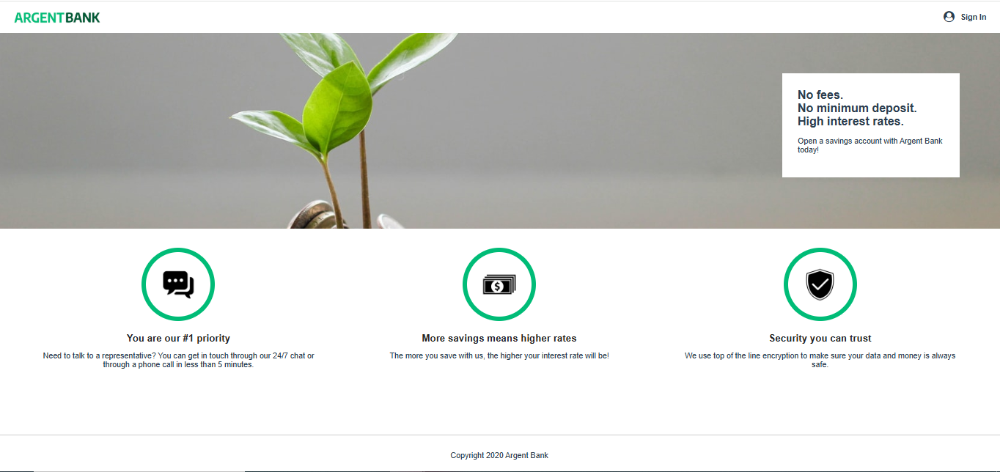

# P13 ArgentBank



## Objectifs

- S'authentifier à une API
- Implémenter un gestionnaire d'état dans une application React
- Intéragir avec une API
- Modéliser une API

## Technologies utilisées

<p align="center">
  <a href="https://skillicons.dev">
    
  </a>
</p>

- [React](https://react.dev/)
- [ViteJS](https://vitejs.dev/)
- [React Router](https://reactrouter.com/en/main)
- [React Redux](https://react-redux.js.org/)
- [Redux Toolkit](https://redux-toolkit.js.org/)
- [Swagger](https://swagger.io/)

## Installation

1. Cloner le dépôt :

```
git clone https://github.com/vatr84/P13_ArgentBank-V2.git
```

2. Accédez au dossier du projet :

```
cd P13_ArgentBank-V2
```

## Backend

1. Accédez au dossier backend :

```
cd backend
```

2. Installez les dépendances :

```
npm install
```

3. Démarrez le serveur :

```
npm run dev:server
```

## Frontend

1. Accédez au dossier frontend :

```
cd frontend
```

2. Installez les dépendances :

```
npm install
```

3. Démarrez l'application :

```
npm run dev
```

